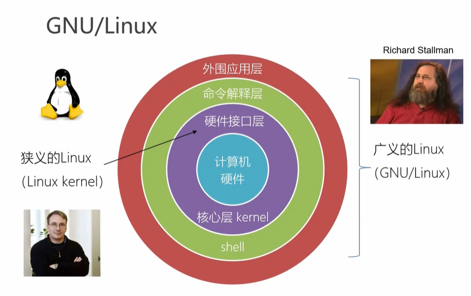
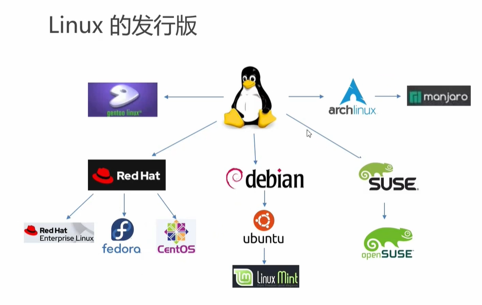
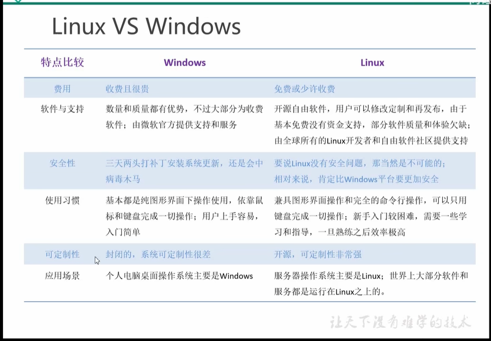
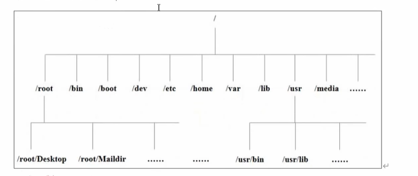
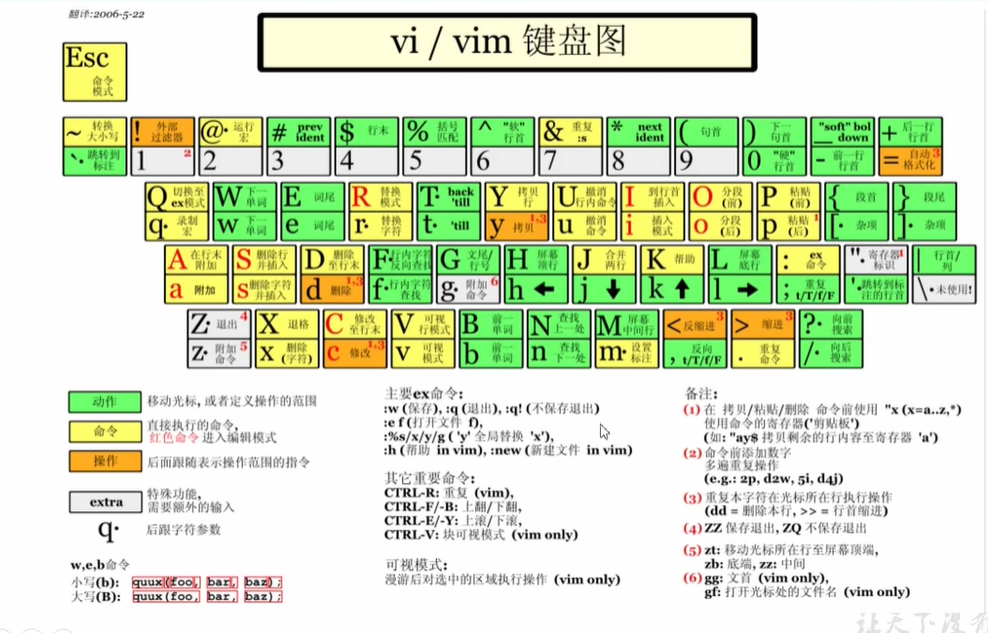
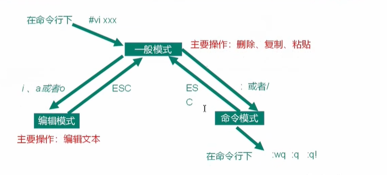
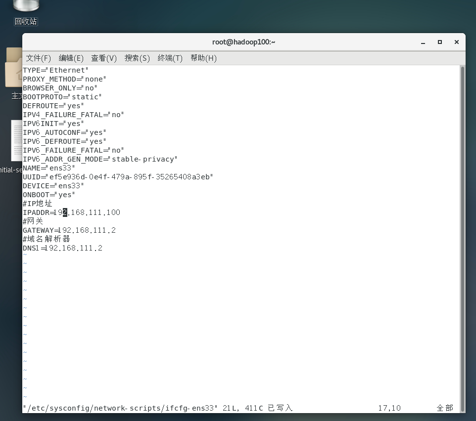
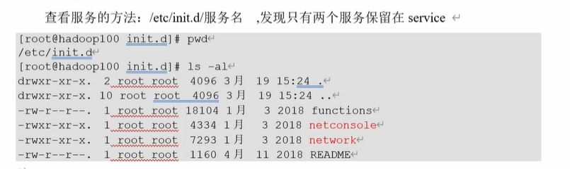
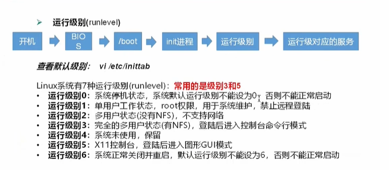

# Linux学习

## 一 Libux概述

### 1-1 Linux 是什么

- Linux是一个操作系统(OS)

### 1-2 GNU/Linux

GPL 表示当前源码是公开的

如果用到了GPL协议的也需要开源

保障了用户的自由

BSD 保障了软件开发者/公司的自由

### 1-3 Linux发行版

### 1-4 Linux VS Windows

### 下载安装 

[清华大学源](https://mirrors.tuna.tsinghua.edu.cn/centos/7.9.2009/isos/x86_64/)

### 使用 shell 控制台

- ctrl + f2 到 f6 shell控制台 

- ctrl + alt 召唤鼠标

- ctrl + f1 回到图形化界面

## 三 文件系统和挂载点

### 3-1 Linux文件

Linux系统中一切皆文件

### 3-2 Linux目录结构

- /bin
  - 是Binary(二进制,输入类型命令)的缩写,这个目录存放着最经常使用的命令
- /sbin
  - s是system的意思,这里存放的是系统管理员使用的系统管理程序
- /lib
  - 系统和应用程序的共享库文件,类似于dll
- /lib64
  - 64位共享库文件
- /usr  (Unix Software Resource)
  - 包含了用户的所有的应用程序和数据, 类似于system32
- /boot 挂载分区时候的目录
- /dev 
  - 设备文件目录
- /etc 
  - 系统配置文件
- /home 
  - 主目录,个性化数据文件存放位置,普通用户的文件夹,没有root用户
- /root 
  - root用户的文件目录
- /opt (optional可选目录)
  - 额外软件约定俗成放到这里
- /media
  - 媒体目录,可以识别一些可移动媒体设备
- /mnt 
  - 挂载目录 根media类似 
- /proc
  - 进程目录
- /run
  - 运行目录,存放的是所有系统运行的实时信息,重启后内文件就会消失
- /srv
  - 系统服务
- /sys
  - 系统内部硬件相关信息
- /tmp (temporary 临时的)
  - 临时目录
- /var
  - 可变目录,存放经常被修改的东西,比如日志

## 四 VI/VIM编辑器

### 4-1 vi/vim 是什么
 
VI是Unix操作系统和类Unix操作系统中最通用的文本编辑器
VIM编辑器是从VI发展出来的一个性能强大的文本编辑器,可以主动的一字体的颜色辨别语法的正确性,方便程序设计,VIM与VI编辑器完全兼容

### 4-2 测试数据准备

(1) 拷贝/etc/profile 数据到/root目录下
  cp /etc/profile/root
    cd /root/

### 4-3 一般模式

以vi打开一个档案就直接进入一般模式了(这是默认的模式) 在这个模式中,你可以使用[上下左右] 按键来移动光标,你可以使用
[删除字符]或[删除整行]来处理档案内容,也可以使用[复制,粘贴]来处理你的文件数据

1) 常用语法
- yy
  - 复制光标当前一行
- y数字y
  - 复制一段(从光标当前行到最后n行)
- p 
  - 箭头移动到目的行粘贴
- u 
  - 撤销上一步
- dd
  - 删除光标当前行
- d数字d
  - 删除光标(含)后多少行
- x
  - 剪切一个字符(当前光标)相当于del
- X 
  - 剪切一个字符(当前光标的前一个)相当于Backspace
- yw
  - 复制一个次
- dw
  - 删除一个词
- shift+6(^)
  - 移动到行头
- shift+4($)
  - 移动到行尾
- w
  - 移动到下一个词(词头位置)
- e
  - 移动到当前词尾
- 1+G
  - 移动到页头,数字
- G
  - 移动到页尾
- 数字 N+G
  - 移动到目标行

2) vi/vim键盘图 

### 4-4 编辑模式

1) 进入编辑模式

查用语法
- i
  - 当前光标前
- a
  - 当前光标后
- o
  - 当前光标行的下一行
- I
  - 光标所在行最前
- A
  - 光标所在行最后
- O
  - 光标行的上一行

2) 退出编辑模式

按 esc 键

### 4-5 指令模式

在一般模式当中,输入[:/?]3个中任何一个按钮,就可以将光标移动到最地下那一行
在一个模式当中,可以提供你[搜寻资料]的动作,而读取,存盘,大量取代字符串,离开vi,显示行号等动作都是在此模式中达成的

1) 基本语法

- :w
  - 保存
- :q
  - 退出
- :wq
  - 保存并退出
- :q!
  - 不保存强制退出
- /要查找的词
  - n 查找下一个, N查找上一个
- :noh
  - 取消高亮显示
- :set nu
  - 显示行号
- :set nonu
  - 关闭行号
- :s/old/new
  - 替换当前行匹配到的第一个old为new
- :s/old/new/g
  - 替换当前行匹配到所有的old为new
- :%s/old/new
  - 替换文档中每一行匹配到的第一个old为new
- :%s/old/new/g
  - 替换文档中匹配到的所有old为new

### 4-4 模式间转换

## 五 网络配置和系统管理操作

### 5-1 查看网络IP 和 网关

VMware提供了三种网络连接模式
 
- 桥接模式:虚拟机直接连接外部物理网络的模式,主要起到了网桥的作用,这种模式下,虚拟机可以直接访问外部网络,并且对外部网络是可见的
- NAT模式: 虚拟机和注解构建一个专用网络,并通过虚拟网络地址转换(NAT)设备对IP进行转换,虚拟机通过共享主机IP可以访问外部网络,但外部网络无法访问虚拟机
- 仅主机模式: 虚拟机只于主机共享一个专用网络,于外部网络无法通信

### 5-2 配置网络 

vim /etc/ sysconfig/ network- scripts/ ifcfg- ens33

重启服务 service network restart

#### 5-2-1修改IP后可能会遇到的问题

1) 物理机能ping通虚拟机,但是虚拟机ping不通物理机,一般都是因为物理机的防火墙问题,把防火墙关闭就行
2) 虚拟机能ping通物理机,但是虚拟机ping不通外网,一般都是因为DNS的设置有问题
3) 虚拟机Ping www.baidu.com显示域名未知等信息,一般查看GATEwAY和DNS设置是否正确
4) 如果以上全部设置还是不行,需要关闭NetworkManager服务
- systemctl stop NetworkManager 关闭
- systemctl disable NetworkManager 禁用
5) 如果检查发现 systemctl status network 有问题 需要检查ifcfg-ens33

### 5-3 配置主机名

hostnamectl set-hostname spark10

## 六 远程登录

通常在工作过程中,公司中使用的真实服务器或者是云服务器,都不允许除运维人员之外的人员直接接触,因此就需要通过远程的登录的方式来操作,所以
远程工具就是必不可缺的,目前比较主流的有Xshell,SSH Secure Shell,SecureCRT, FinalShell等,根据自己的习惯自行选择

## 七 系统管理

### 7-1 Linux 中的进程和服务

计算机中,一个正在执行的程序或命令,被叫做"进程"(process)
启动之后一直存在,常驻内存的进程,一般被称作"服务"(service)

### 7-2 service 服务管理(CentOS6版本-了解)

1) 基本语法

service 服务名 start|stop|restart|status

2) 经验技巧

查看服务的方法: /etc/init.d/服务名,发现只有两个服务保留在service

### 7-3 systemctl (CentOs7版本-重点掌握)

1) 基本语法

systemctl start|stop|restart|status 服务名

2) 经验技巧

查看服务的方法 /user/lib/systemd/

### 7-4 系统运行级别

1) Linux运行级别[CentOS 6], 如图所示

- Linux系统内核加载后,会启动init进程,根据进程级别,运行对应的服务

2) ContOS7的运行级别简化为:

  - multi-user.target 等价于原运行基表3(多用户有网,无图形界面)
  - graphical.target 等价于原运行级别5(多用户有网,有图形界面)

3) 查看当前运行级别
  
  - systemctl get-default

4) 修改当前运行级别

  - systemctl set-default TARGET.target(这里TARGET取multi-user或者graphical)

### 7-5 关闭防火墙

1) 查看防火墙状态
- systemctl status firewalld
2) 关闭防火墙
- systemctl stop firewalld.service
3) 关闭防火墙开机自启动
- systemctl disable firewalld.service
4) 开启防火墙开机自启动
- systemctl enable firewalld.service
5) 开启防火墙
-  systemctl start firewalld.service

### 7.6 关机重启命令

在linux领域大多用在服务器上,很少遇到关机的操作,毕竟服务器上跑一个服务是永无止境的,除非特殊情况下,不得已才会关机

1) 基本语法
   1) sync  将数据用内存同步到硬盘中
   2) halt  停机关闭系统,但不断电
   3) poweroff 关机,断电
   4) reboot 就是重启,等同于shutdown -r now
   5) shutdown[选择] 时间
      - -H 与--halt 关机
      - -r -r=reboot重启
      - now 立刻关机
      - 时间 等待多久后关机(时间单位是分钟)
      - 具体时间 定时关机
2) 经验技巧

Linux系统中为了提高磁盘的读写效率,对磁盘采取了"预读迟写"操作方式,当用户保存文件时,Linux核心并不一定立即将保存数据写入物理磁盘中,
而是将数据保存在缓冲区中,等待缓冲器满时再写入磁盘,这种方式可以极大的提高磁盘写入数据的效率,但是也带来了安全隐患,如果数据还未写入磁盘时
系统断点或者其他严重问题出现,将导致数据丢失 使用sync指令可以立即将缓冲器的数据写入磁盘

3) 案例
   1) 将数据由内存同步到硬盘中
   
          sync

   2) 重启
      
          reboot
   
   3) 停机(不断电)
   
          halt
   
   4) 计算机将在1分钟后关机,并且会显示在登录用户的当前屏幕中

          shutdown -h 1
   
   5) 立刻关机(等同于 poweroff)
   
          shutdown -h now
   
   6) 系统李马重启(等同于reboot)
   
          shutdown -r now
   
## 七 常用基本命令(重要)
    
Shell 可以看作时一个命令解释器,未我们提供了交互式的文件控制台界面,我们可以通过终端控制台输入命令,由shell进行解释并最终交给内核执行,

### 7-1 帮助命令

#### 7-1-1 man 获得帮助信息

1) 基本语法 
- man[命令或配置文件] (功能描述:获得帮助信息)

#### 7-1-2 help 获得shell内置命令的帮助信息

基本语法

- help 命令 (功能描述:获得shell内置命令的帮助信息)

- 命令 --help (也可以获得帮助信息)

#### 常用快捷键

- ctrl+C
  - 停止进程
- ctrl+l
  - 清屏,等同于clear;彻底清屏时:reset
- 善于用tab键
  - 提示(更重要的时可以防止敲错)
- 上下键
  - 查找执行过的命令

### 7-2 文件目录类

#### 7-2-1 pwd 显示当前工作目录的绝对路径

pwd: print working directory 打印工作目录

1) 基本语法

- pwd 显示当前工作目录的绝对路径

#### 7-2-2 ls 列出目录的内容

ls: list 列出目录的内容

1) 基本语法

    ls[选择][目录或是文件]
2) 选项说明

- -a 
  - 全部的文件,连同隐藏档(开头未.的文件一起列出来)
- -l 
  - 长数据串列出,包含文件的属性与权限等等数据 等价于"ll"

3) 显示说明
    
    每行列出的信息依次是: 文件类型与权限,链接数,文件属主,文件属组,文件大小用byte来表示,建立或最近修改的时间 名字

#### 7-2-3 mkdir 创建一个新的目录

mkdir:Make directory 创建目录

1) 基本语法

- mkdir[选项] 要创建的目录
2) 选项说明
- -p 创建多层目录

#### 7-2-4 rmdir 删除一个空的目录

mkdir: Remove directory 移除目录

1) 基本语法
    
- rmdir 要删除的空目录

#### 7-2-5 touch 创建空文件

1) 基本语法 
- touch 文件名称

#### 7-2-6 cp 复制文件或目录

1) 基本语法

    cp [选择] source dest 复制source文件到dest
2) 选项说明

- -r
  - 递归复制整个文件夹

3) 参数说明

- source
  - 源文件
- dest
  - 目标文件

4) 经验技巧
   
强制覆盖不提示的方法: /cp

#### 7-2-7 删除文件或目录

1) 基本语法 

rm[选项] delete File 递归删除目录中所有内容

2) 选项说明
 
- -r
  - 递归删除目录中所有内容
- f
  - 强制执行删除操作,而不提示用户进行确认
- -v
  - 显示指令的详细过程

#### 7-2-8 mv 移动文件与目录或重命名

1) 基本语法
   1) mv oldNameFile newNameFile 重命名
   2) mv temp /movefile/targetFolder 移动文件

#### 7-2-9 查看文件内容

查看文件内容,从第一行开始显示

1) 基本语法

cat [选项] 要查看的文件

2) 选项说明

- -n 显示所有行的行号,包括空行

3) 经验技巧

- 一般查看比较小的文件,一屏幕能显示全

#### 7-2-10 more 文件内容分屏查看器

more指令是一个基于VI编辑器的文本过滤器,它以全屏幕的方式按页显示文本文件的内容 more指令中内置了若干个快捷键,详见操作说明

1) 基本语法

more 要查看的文件

2) 操作说明

- 空白键(space)
  - 代表向下翻 一页
- Enter
  - 代表向下翻 一行
- q
  - 代表立刻离开 more, 不再显示该文件内容
- Ctrl + F 
  - 向下滚动一屏
- Ctrl + B
  - 向返回上一屏
- =
  - 输出当前的行号
- :f 
  - 输出文件名和当前的行号
  
#### 7-2-12 less分屏显示文件内容

less指令用来分屏查看文件内容,它的共能与more指令类似,大hi是比more指令更加强大
支持各种显示终端,less指令在现实文件内容时,并不是一次将整个文件加载之后才现实,而是根据现实需要加载呢日哦那个,
对于显示大型文件具有较高的效率

1) 基本语法

less 要查看的文件

2) 操作说明

- 空白键
  - 向下翻动一页
- pagedown
  - 向下翻动一页
- pageup
  - 向上翻动一页
- /字串
  - 向下搜寻[字串]的功能, n: 向下查找, N:向上查找
- ?字串
  - 向上搜寻[字串]的功能,n:向上查找,N:向下查找
- q
  - 离开less这个程序

3) 经验技巧

    

