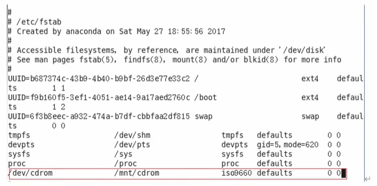

# Linux学习

## 一 Libux概述

### 1-1 Linux 是什么

- Linux是一个操作系统(OS)

### 1-2 GNU/Linux

GPL 表示当前源码是公开的

如果用到了GPL协议的也需要开源

保障了用户的自由

BSD 保障了软件开发者/公司的自由

### 1-3 Linux发行版

### 1-4 Linux VS Windows

### 下载安装 

[清华大学源](https://mirrors.tuna.tsinghua.edu.cn/centos/7.9.2009/isos/x86_64/)

### 使用 shell 控制台

- ctrl + f2 到 f6 shell控制台 

- ctrl + alt 召唤鼠标

- ctrl + f1 回到图形化界面

## 三 文件系统和挂载点

### 3-1 Linux文件

Linux系统中一切皆文件

### 3-2 Linux目录结构

- /bin
  - 是Binary(二进制,输入类型命令)的缩写,这个目录存放着最经常使用的命令
- /sbin
  - s是system的意思,这里存放的是系统管理员使用的系统管理程序
- /lib
  - 系统和应用程序的共享库文件,类似于dll
- /lib64
  - 64位共享库文件
- /usr  (Unix Software Resource)
  - 包含了用户的所有的应用程序和数据, 类似于system32
- /boot 挂载分区时候的目录
- /dev 
  - 设备文件目录
- /etc 
  - 系统配置文件
- /home 
  - 主目录,个性化数据文件存放位置,普通用户的文件夹,没有root用户
- /root 
  - root用户的文件目录
- /opt (optional可选目录)
  - 额外软件约定俗成放到这里
- /media
  - 媒体目录,可以识别一些可移动媒体设备
- /mnt 
  - 挂载目录 根media类似 
- /proc
  - 进程目录
- /run
  - 运行目录,存放的是所有系统运行的实时信息,重启后内文件就会消失
- /srv
  - 系统服务
- /sys
  - 系统内部硬件相关信息
- /tmp (temporary 临时的)
  - 临时目录
- /var
  - 可变目录,存放经常被修改的东西,比如日志

## 四 VI/VIM编辑器

### 4-1 vi/vim 是什么
 
VI是Unix操作系统和类Unix操作系统中最通用的文本编辑器
VIM编辑器是从VI发展出来的一个性能强大的文本编辑器,可以主动的一字体的颜色辨别语法的正确性,方便程序设计,VIM与VI编辑器完全兼容

### 4-2 测试数据准备

(1) 拷贝/etc/profile 数据到/root目录下
  cp /etc/profile/root
    cd /root/

### 4-3 一般模式

以vi打开一个档案就直接进入一般模式了(这是默认的模式) 在这个模式中,你可以使用[上下左右] 按键来移动光标,你可以使用
[删除字符]或[删除整行]来处理档案内容,也可以使用[复制,粘贴]来处理你的文件数据

1) 常用语法
- yy
  - 复制光标当前一行
- y数字y
  - 复制一段(从光标当前行到最后n行)
- p 
  - 箭头移动到目的行粘贴
- u 
  - 撤销上一步
- dd
  - 删除光标当前行
- d数字d
  - 删除光标(含)后多少行
- x
  - 剪切一个字符(当前光标)相当于del
- X 
  - 剪切一个字符(当前光标的前一个)相当于Backspace
- yw
  - 复制一个次
- dw
  - 删除一个词
- shift+6(^)
  - 移动到行头
- shift+4($)
  - 移动到行尾
- w
  - 移动到下一个词(词头位置)
- e
  - 移动到当前词尾
- 1+G
  - 移动到页头,数字
- G
  - 移动到页尾
- 数字 N+G
  - 移动到目标行

2) vi/vim键盘图 

### 4-4 编辑模式

1) 进入编辑模式

查用语法
- i
  - 当前光标前
- a
  - 当前光标后
- o
  - 当前光标行的下一行
- I
  - 光标所在行最前
- A
  - 光标所在行最后
- O
  - 光标行的上一行

2) 退出编辑模式

按 esc 键

### 4-5 指令模式

在一般模式当中,输入[:/?]3个中任何一个按钮,就可以将光标移动到最地下那一行
在一个模式当中,可以提供你[搜寻资料]的动作,而读取,存盘,大量取代字符串,离开vi,显示行号等动作都是在此模式中达成的

1) 基本语法

- :w
  - 保存
- :q
  - 退出
- :wq
  - 保存并退出
- :q!
  - 不保存强制退出
- /要查找的词
  - n 查找下一个, N查找上一个
- :noh
  - 取消高亮显示
- :set nu
  - 显示行号
- :set nonu
  - 关闭行号
- :s/old/new
  - 替换当前行匹配到的第一个old为new
- :s/old/new/g
  - 替换当前行匹配到所有的old为new
- :%s/old/new
  - 替换文档中每一行匹配到的第一个old为new
- :%s/old/new/g
  - 替换文档中匹配到的所有old为new

### 4-4 模式间转换

## 五 网络配置和系统管理操作

### 5-1 查看网络IP 和 网关

VMware提供了三种网络连接模式
 
- 桥接模式:虚拟机直接连接外部物理网络的模式,主要起到了网桥的作用,这种模式下,虚拟机可以直接访问外部网络,并且对外部网络是可见的
- NAT模式: 虚拟机和注解构建一个专用网络,并通过虚拟网络地址转换(NAT)设备对IP进行转换,虚拟机通过共享主机IP可以访问外部网络,但外部网络无法访问虚拟机
- 仅主机模式: 虚拟机只于主机共享一个专用网络,于外部网络无法通信

### 5-2 配置网络 

vim /etc/ sysconfig/ network- scripts/ ifcfg- ens33

重启服务 service network restart

#### 5-2-1修改IP后可能会遇到的问题

1) 物理机能ping通虚拟机,但是虚拟机ping不通物理机,一般都是因为物理机的防火墙问题,把防火墙关闭就行
2) 虚拟机能ping通物理机,但是虚拟机ping不通外网,一般都是因为DNS的设置有问题
3) 虚拟机Ping www.baidu.com显示域名未知等信息,一般查看GATEwAY和DNS设置是否正确
4) 如果以上全部设置还是不行,需要关闭NetworkManager服务
- systemctl stop NetworkManager 关闭
- systemctl disable NetworkManager 禁用
5) 如果检查发现 systemctl status network 有问题 需要检查ifcfg-ens33

### 5-3 配置主机名

hostnamectl set-hostname spark10

## 六 远程登录

通常在工作过程中,公司中使用的真实服务器或者是云服务器,都不允许除运维人员之外的人员直接接触,因此就需要通过远程的登录的方式来操作,所以
远程工具就是必不可缺的,目前比较主流的有Xshell,SSH Secure Shell,SecureCRT, FinalShell等,根据自己的习惯自行选择

## 七 系统管理

### 7-1 Linux 中的进程和服务

计算机中,一个正在执行的程序或命令,被叫做"进程"(process)
启动之后一直存在,常驻内存的进程,一般被称作"服务"(service)

### 7-2 service 服务管理(CentOS6版本-了解)

1) 基本语法

service 服务名 start|stop|restart|status

2) 经验技巧

查看服务的方法: /etc/init.d/服务名,发现只有两个服务保留在service

### 7-3 systemctl (CentOs7版本-重点掌握)

1) 基本语法

systemctl start|stop|restart|status 服务名

2) 经验技巧

查看服务的方法 /user/lib/systemd/

### 7-4 系统运行级别

1) Linux运行级别[CentOS 6], 如图所示

- Linux系统内核加载后,会启动init进程,根据进程级别,运行对应的服务

2) ContOS7的运行级别简化为:

  - multi-user.target 等价于原运行基表3(多用户有网,无图形界面)
  - graphical.target 等价于原运行级别5(多用户有网,有图形界面)

3) 查看当前运行级别
  
  - systemctl get-default

4) 修改当前运行级别

  - systemctl set-default TARGET.target(这里TARGET取multi-user或者graphical)

### 7-5 关闭防火墙

1) 查看防火墙状态
- systemctl status firewalld
2) 关闭防火墙
- systemctl stop firewalld.service
3) 关闭防火墙开机自启动
- systemctl disable firewalld.service
4) 开启防火墙开机自启动
- systemctl enable firewalld.service
5) 开启防火墙
-  systemctl start firewalld.service

### 7.6 关机重启命令

在linux领域大多用在服务器上,很少遇到关机的操作,毕竟服务器上跑一个服务是永无止境的,除非特殊情况下,不得已才会关机

1) 基本语法
   1) sync  将数据用内存同步到硬盘中
   2) halt  停机关闭系统,但不断电
   3) poweroff 关机,断电
   4) reboot 就是重启,等同于shutdown -r now
   5) shutdown[选择] 时间
      - -H 与--halt 关机
      - -r -r=reboot重启
      - now 立刻关机
      - 时间 等待多久后关机(时间单位是分钟)
      - 具体时间 定时关机
2) 经验技巧

Linux系统中为了提高磁盘的读写效率,对磁盘采取了"预读迟写"操作方式,当用户保存文件时,Linux核心并不一定立即将保存数据写入物理磁盘中,
而是将数据保存在缓冲区中,等待缓冲器满时再写入磁盘,这种方式可以极大的提高磁盘写入数据的效率,但是也带来了安全隐患,如果数据还未写入磁盘时
系统断点或者其他严重问题出现,将导致数据丢失 使用sync指令可以立即将缓冲器的数据写入磁盘

3) 案例
   1) 将数据由内存同步到硬盘中
   
          sync

   2) 重启
      
          reboot
   
   3) 停机(不断电)
   
          halt
   
   4) 计算机将在1分钟后关机,并且会显示在登录用户的当前屏幕中

          shutdown -h 1
   
   5) 立刻关机(等同于 poweroff)
   
          shutdown -h now
   
   6) 系统李马重启(等同于reboot)
   
          shutdown -r now
   
## 七 常用基本命令(重要)
    
Shell 可以看作时一个命令解释器,未我们提供了交互式的文件控制台界面,我们可以通过终端控制台输入命令,由shell进行解释并最终交给内核执行,

### 7-1 帮助命令

#### 7-1-1 man 获得帮助信息

1) 基本语法 
- man[命令或配置文件] (功能描述:获得帮助信息)

#### 7-1-2 help 获得shell内置命令的帮助信息

基本语法

- help 命令 (功能描述:获得shell内置命令的帮助信息)

- 命令 --help (也可以获得帮助信息)

#### 常用快捷键

- ctrl+C
  - 停止进程
- ctrl+l
  - 清屏,等同于clear;彻底清屏时:reset
- 善于用tab键
  - 提示(更重要的时可以防止敲错)
- 上下键
  - 查找执行过的命令

### 7-2 文件目录类

#### 7-2-1 pwd 显示当前工作目录的绝对路径

pwd: print working directory 打印工作目录

1) 基本语法

- pwd 显示当前工作目录的绝对路径

#### 7-2-2 ls 列出目录的内容

ls: list 列出目录的内容

1) 基本语法

    ls[选择][目录或是文件]
2) 选项说明

- -a 
  - 全部的文件,连同隐藏档(开头未.的文件一起列出来)
- -l 
  - 长数据串列出,包含文件的属性与权限等等数据 等价于"ll"

3) 显示说明
    
    每行列出的信息依次是: 文件类型与权限,链接数,文件属主,文件属组,文件大小用byte来表示,建立或最近修改的时间 名字

#### 7-2-3 mkdir 创建一个新的目录

mkdir:Make directory 创建目录

1) 基本语法

- mkdir[选项] 要创建的目录
2) 选项说明
- -p 创建多层目录

#### 7-2-4 rmdir 删除一个空的目录

mkdir: Remove directory 移除目录

1) 基本语法
    
- rmdir 要删除的空目录

#### 7-2-5 touch 创建空文件

1) 基本语法 
- touch 文件名称

#### 7-2-6 cp 复制文件或目录

1) 基本语法

    cp [选择] source dest 复制source文件到dest
2) 选项说明

- -r
  - 递归复制整个文件夹

3) 参数说明

- source
  - 源文件
- dest
  - 目标文件

4) 经验技巧
   
强制覆盖不提示的方法: /cp

#### 7-2-7 删除文件或目录

1) 基本语法 

rm[选项] delete File 递归删除目录中所有内容

2) 选项说明
 
- -r
  - 递归删除目录中所有内容
- f
  - 强制执行删除操作,而不提示用户进行确认
- -v
  - 显示指令的详细过程

#### 7-2-8 mv 移动文件与目录或重命名

1) 基本语法
   1) mv oldNameFile newNameFile 重命名
   2) mv temp /movefile/targetFolder 移动文件

#### 7-2-9 查看文件内容

查看文件内容,从第一行开始显示

1) 基本语法

cat [选项] 要查看的文件

2) 选项说明

- -n 显示所有行的行号,包括空行

3) 经验技巧

- 一般查看比较小的文件,一屏幕能显示全

#### 7-2-10 more 文件内容分屏查看器

more指令是一个基于VI编辑器的文本过滤器,它以全屏幕的方式按页显示文本文件的内容 more指令中内置了若干个快捷键,详见操作说明

1) 基本语法

more 要查看的文件

2) 操作说明

- 空白键(space)
  - 代表向下翻 一页
- Enter
  - 代表向下翻 一行
- q
  - 代表立刻离开 more, 不再显示该文件内容
- Ctrl + F 
  - 向下滚动一屏
- Ctrl + B
  - 向返回上一屏
- =
  - 输出当前的行号
- :f 
  - 输出文件名和当前的行号
  
#### 7-2-12 less分屏显示文件内容

less指令用来分屏查看文件内容,它的共能与more指令类似,大hi是比more指令更加强大
支持各种显示终端,less指令在现实文件内容时,并不是一次将整个文件加载之后才现实,而是根据现实需要加载呢日哦那个,
对于显示大型文件具有较高的效率

1) 基本语法

less 要查看的文件

2) 操作说明

- 空白键
  - 向下翻动一页
- pagedown
  - 向下翻动一页
- pageup
  - 向上翻动一页
- /字串
  - 向下搜寻[字串]的功能, n: 向下查找, N:向上查找
- ?字串
  - 向上搜寻[字串]的功能,n:向上查找,N:向下查找
- q
  - 离开less这个程序

#### 7-2-13 echo

echo 输出内容到控制台

1) 基本语法

    echo [选择] [输出内容]

选择:

- -e: 支持反斜杠的字符转换

控制字符串及其作用:

- \\
  - 输出\本身
- \n
  - 换行符
- \t
  - 制表符,也就是Tab键

#### 7-2-14 显示文件头部内容

head用于显示文件的开头部分内容,默认情况下head指令显示文件的前10行内容

1) 基本语法

- head 文件 查看文件头10行内容
- head -n 5 文件 查看文件头5行内容,5可以是任意行数

2)选项说明名

- -n<函数> 执行显示头部内容的行数

#### 7-2-15 tail 输出文件尾部内容

tail用于输出文件中尾部的内容,默认情况下tail指令显示文件后10行内容

1) 基本语法
   1) tail 文件 查看文件尾部10行内容
   2) tail -n 5 文件 查看我呢见尾部5行内容,5可以是任意行数
   3) tail -f 文件 实时追踪文档所有更新

2) 选项说明

    - -n<函数> 输出文件尾部 n 行内容
    - -f 显示文件最新追加的内容,监视文件变化

实时追踪文档的时候可以使用ctrl+s的时候暂停,ctrl+q 继续, ctrl+c退出

扩展: 实时监控是按照索引号进行监控的(ls -i 文件   查看索引号),如果对文件进行编辑或者重写都会改变文件索引号,实时追踪的时候会提示错误

#### 7-2-16 >输出重定向 >>追加

1) 基本语法
   1) ls -l > 文件 列表的内容写入文件 a.txt中(覆盖写)
   2) ls -al >> 文件 列表的内容追加到文件 aa.txt的末尾
   3) cat 文件1 > 文件2 将文件1的内容覆盖到文件2
   4) echo "内容" >> 文件

#### 7-2-17 ln 软链接

软连接也成为符号链接,类似于wendows里的快捷方式,由自己的数据块,主要存放其他文件的路径

1) 基本语法
   ln -s[原文件或目录][软链接名] 给文件创建一个软连接
2) 经验技巧
- 删除软链接: rm -rf 软链接名 而不是 rm -rf 软链接名/
- 如果使用 rm -rf 软链接名/删除 会把链接对应的真实目录下的内容删除
- 查询: 通过ll就可以查看,列表属性第一位是l 尾部会有位置指向

#### 7-2-18 查看已经执行过历史命令

1) 基本语法

history 查看已经执行过历史命令

history -c 删除历史命令(干坏事专用)

### 7-3 时间日期类

1) 基本语法

date[OPTION]...[+FORMAT]

2) 选项说明

- -d<时间字符串> 显示指定的时间字符表示的时间,而非当前时间
- -s<日期时间> 设置系统日期时间

3) 参数说明
- <+日期时间格式> 指定显示时使用的日期时间格式

#### 7-3-1 date 显示当前时间

1) 基本语法
   1) date 显示当前的时间
   2) date + %Y 显示当前年份
   3) date + %m 显示当前月份
   4) date + %d 显示当前是哪一天
   5) data "+%Y-%m-%d%H:%M:%S" 下使年月日时分秒

#### 7-3-2 date显示非当前时间

1) 基本语法
   1) date -d '1 days ago' 显示前一天时间
   2) date -d '-1 days ago' 显示明天时间

ntpdate 服务器 同步时钟

#### 7-3-3 date 设置系统时间

1) 基本语法

date -s 字符串时间

#### 7-3-4 cal 查看日历

1) 基本语法

- cal[选项]

2) 选项说明 
- 具体某一年 显示这一年的日历

### 7-4 用户管理命令

#### 7-4-1 useradd 添加用户

1) 基本语法

- useradd 用户名 添加新用户
- useradd -g 组名 用户名 添加新用户到某个组

#### 7-4-2 passwd 设置用户密码

1) 基本语法

- passwd 用户名 设置用户名密码

#### 7-4-3 id 验证用户是否存在

1) 基本语法

    id 用户名

#### 7-4-4 cat /etc/passwd 查看创建了哪些用户

1) 用法
cat /etc passwd

#### 7-4-5 su 切换用户

1) 基本语法

    su 用户名称

#### 7-4-6 who 查看用户身份

1) 基本语法
   - who am i 
     - 用于查看用户进程
   - whoami
     - 用于查看用户身份
   
2) 注意

    - who am i 查看的是当前是在哪个用户进行下进行的操作
    - whoami 是查看当前是在哪个用户身份下进行的操作 

#### 7-4-7 sudo 设置普通用户具有root权限

1) 添加zhouzhou用户并对其设置密码

- useradd zhouzhou
- passwd zhouzhou

2) 修改配置文件
   
- vi /etc/sudoers

修改/etc/sudoers文件,找到下面一行(91),在root下面添加一行,如下所示

        ## Allow root to run any commands anywhere
        root ALL=(ALL) ALL
        zhouzhou ALL=(ALL) ALL

或者配置成采用sudo命令时,不需要输入密码

        ## Allow root to run any commands anywhere
        root ALL=(ALL) ALL
        zhouzhou ALL=(ALL) NOPASSWD:ALL

修改完毕后,可以用zhouzhou账号登录,然后用命令sudo,即可获得root权限进行操作

#### 7-4-8 usermod修改哟呼

1) 基本语法

- usermod -g 用户组 用户名

2) 选项说明

- -g 修改用户的初始登录组,给定的组必须存在 默认组id是1

### 7-5 用户组管理命令

每个用户都有一个用户组,系统可以对一个用户组的所有用户进行集中挂历,不同Linux系统对用户组的规定有所不同

如Linux下的用户属于与它同名的用户组,这个用户组在创建用户时同时创建

用户组的管理涉及用户组的添加,删除和修改,组的添加,删除和修改实际上是对/etc/group文件的更新

#### 7-5-1 groupadd 新增组

1) 基本语法

- groupadd 组名

#### 7-5-2 groupdel 删除组

1) 基本语法

- groupdel 组名

#### groupmod  7-5-3 修改组

1) 基本用法

- groupmod -n 新组名 原组名  
  - 修改组名

### 7-6文件权限类

#### 7-6-1 文件属性

Linux系统是一种典型的多用户系统不同的用户处于不同的地位,拥有不同的权限。为了保护系统的安全性，Linux系统对不同的用户访问同一文件（包括目录文件）的权限做了不同的规定。在Linux中我们可以使用ll或者ls -l命令来显示一个文件的属性以及文件所属的用户和组

1) 从左到右的10个字符表示
   1) 0首位表示类型
       
       在Linux中第一个字符代表这个文件是目录，文件或者链接文件
       
        -代表文件
        
        d代表目录
   
        l链接文档（link file）
   2) 第1-3位确定属主（该文件的所有者）拥有该文件的权限 ---User
   3) 第4-6位确定属组（所有者的同组用户）拥有该文件的权限 --Group
   4) 第7-9位确定其他用户拥有该文件的权限 --Other
   

如果没有权限，就会出现减号【-】，从左至右用0-9这些数字来表示

2) rxw作用文件和目录的不同解释
   1) 作用到文件：
      1) 【r】代表可读（read）：可以读取，查看
      2) 【w】代表可写（write）：可以修改，但是不代表可以删除该文件，删除一个文件前提是对该文件所在的目录有写权限，菜呢个删除该文件
      3) 【x】代表可执行（execute）：可以被系统执行
   2) 作用到目录：
      1) 【r】代表可读（read）：可以读取，ls查看目录内容
      2) 【w】代表可写（write）：可以修改，目录内创建+删除+重命名目录
      3) 【x】代表可执行（execute）：可以进入该目录
      

    -rw-------. 1 root root 1851 Jan 24 17:14 anaconda-ks.cfg
    1表示硬链接数量 ，第一个root是属主 ，第二个root是属组 后面是文件创建/更改的时间 最后是文件的名字
    1）如果查看到是文件：链接数指的是硬链接个数
    2）如果查看的是文件夹： 链接数指的是子文件夹个数

    

#### 7-6-2 chmod 改变权限

1) 基本语法

- 第一种方式变更权限
  - chmod [{ugoa}{+-=}{rwx}] 文件或目录
- 第二种方式变更权限
  - chmod [mode=421] [文件或目录]

2) 经验技巧

u:所有者 g:所有组 o:其他人 a:所有人(u、g、o的总和)

r=4(二进制100) w=2(二进制010) x=1(二进制001) rwx=4+2+1=7(二进制111)

修改整个文件夹里面所有文件,所属组,其他用户都具有可读可写可执行权限

        chmod -R 777 文件夹

#### 7.6.3 chown改变所有者

1) 基本语法
    
    chown [选项][最终用户][文件或目录] 改变文件或者目录的所有者
2) 选项说明

- -R 递归操作

### 7-7 搜索查找类

#### 7-7-1 find查找文件或目录

find指令将从指定目录向下递归地遍历其各个子目录,将满足条件的文件显示在终端

1) 基本语法

- find [搜索范围][选择]

2) 选项说明

- 按照指定的文件名查找模式查找文件
  - -name<查找方式> 
- 查找属于指定用户名所有文件
  - -user<用户名>
- 按照指定的文件大小查找文件
  - -size<文件大小>
  - 单位为:
    - b 块(512字节)
    - c 字节
    - w 字(2字节)
    - k 千字节
    - M 兆字节
    - G 吉字节

#### 7-7-2 快速定位文件路径

 &emsp;locate指令里哟个事先建立的系统中国所有文件名称及路径的locate数据库实现快速定位给定的文件. Locate指令无需遍历整个文件系统,查询速度较快.为了保证查询结果的准确度,管理员必须定期更新locate时刻

1) 基本语法

- locate 搜索文件

2) 经验技巧

- 由于locate指令基于数据库进行查询,所以第一次运行前,必须使用updatedb指令创建locate数据库

#### 7-7-3 grep过滤查找及"|"管道符

管道符."|",表示将前一个命令的处理结果输出传递给后面的指令处理

1) 基本语法

grep 选项 查找内容 源文件

2) 选项说明

- 显示匹配行及行号
  - -n
  

### 7-8 压缩和解压类

#### 7-8-1 gzip/gunzip 压缩

1) 基本语法

- 压缩文件,只能将文件压缩为*.gz文件
  - gzip 文件
- 解压缩文件命令
  - gunzip 文件.gz

2) 经验技巧
    1) 只能压缩文件,不能压缩目录
    2) 不保留原来的文件
    3) 同时多个文件会产生多个压缩包
  
#### 7-8-2 zip/unzip压缩

1) 基本语法

- 压缩文件和目录的命令
    - zip[选项] XXX.zip 将要压缩的文件
- 解压缩文件
  - unzip[选项] xxx.zip

2) 选项说明

- zip选项
  - 压缩目录
    - -r
- unzip选项
  - 指定解压后文件的存放目录
  - -d<目录>

3) 经验技巧

zip压缩命令在 window/linux都通用,可以压缩目录且保留源文件

#### 7-8-3 tar打包

1) 基本语法
- 打包目录,压缩后的文件格式.tar.gz
  - tar [选项] xxx.tar.gz 将要打包进去的内容

2) 选项说明

- 产生.tar打包文件
  - -c
- 显示详细信息
  - -v
- 指定压缩后的文件名
  - -f
- 打包同时压缩
  - -z
- 解包.tar文件
  - -x
- 解压到指定目录
  - -C

### 7-9 磁盘查看和分区类

#### 7-9-1 查看问价和目录占用的磁盘空间

- du: disk usage

1) 基本语法
- 显示目录下每个子目录的磁盘使用情况
  - du 目录/文件

2) 选项说明

- 已任命较易阅读的GBytes,MBytes,KBytes等格式自行显示
  - -h
- 不仅查看子目录大小,还包括文件
  - -a
- 显示所有文件和子目录大小后,显示总和
  - c
- 只显示总和
  - -s
- 指定统计系目录的深度为第n层
  - --max-depth=n
  

#### 7-9-2 df查看磁盘空间使用情况

df: didk free 空余磁盘

1) 基本语法

- 列出文件系统的整个磁盘使用量,检查文件系统的磁盘空间占用情况
  - df 选项
  
2) 选项说明

- 以人们较易阅读的GBytes,MBytes,KBytes等格式自行显示
  - -h

#### 7-9-3 lsblk 查看设备挂载情况

#### 7-9-4 mount/umount 挂载/卸载

设置开机自动挂载

        vi /etc/fstab

添加红框中内容,保存退出

#### fdis分区

1) 基本语法

- 查看磁盘分区详情
  - fdisk -l
- 对新增硬盘进行分区操作
  - fdisk 硬盘设备名

2) 选型说明

- 显示所有硬盘分区列表
  - -I

3) 经验技巧

- 该命令必须在root用户下才能使用

### 7-10 进程管理类

进程是正在执行的一个程序或命令,每一个进程都是一个运行的实体,都有自己的地址空间,并占用一定的系统资源

#### 7-10-1 ps 查看当前系统给进程状态

1) 基本语法

- 查看系统中所有进程
  - ps aux | grep xxx

- 可以查看子父进程之间的关系
- ps -ef | grep xxx

2) 选项说明

- 列出带有终端的所有用户的进程
  - a
- 列出当前用户的所有进程,包括没有终端的进车给
  - x
- 面向用户友好的显示风格
  - u
- 列出所有进程
  - -e
- 列出某个用户关联的所有进程
  - -u
- 显示完整格式的进程列表
  - -f
3) 功能说明

    1) ps aux显示信息说明
- USER: 该进程是由那个用户产生的
- PID: 进程的ID号
- %CPU: 该进程占用CPU资源的百分比,占用越高,进程越耗费资源
- %MEM: 该进程占用为u里内存的百分比,占用越高,进程越耗费资源
- VSZ: 该进程占用虚拟内存的大小,单位KB
- RSS: 该进程占用实际物理内存的大小,单位KB
- TTY: 该进程是在哪个终端运行的,对于CentOS来说,tty1是图形化终端
- tty2-tty6: 是本地的字符界面终端 pts/0-255代表虚拟终端
- STAT: 进程状态 常见的状态有:
  - R:运行状态
  - S:睡眠状态
  - T:暂停状态
  - Z:僵尸状态
  - s:包含子进程
  - 1:多线程状态
  - +:前台显示
- START: 该进程的启动时间
- TIME: 该几次呢还给你占用CPU的运算时间,注意不是系统时间
- COMMAND: 产生词进程的命令名 
 
2) ps -ef显示信息说明  
- UID: yoghurtID
- PID进程的ID号
- PPID父进程的ID号
- C: CPU用于计算执行优先级的因子 数值越大,表明进程是CPU密集型运算,执行优先权会越低;数值越小,表明是进程I/O密集型运算,执行优先级会提高
- STime: 进程启动的时间
- TTY:完整的终端名称
- TIME:CPU时间
- CMD:启动进程所用的命令和参数

3) 经验技巧

- 如果想查看进程的CPU占用率和内存占用率,可以使用aux
- 如果想查看进程的父进程ID可以使用ef

    

